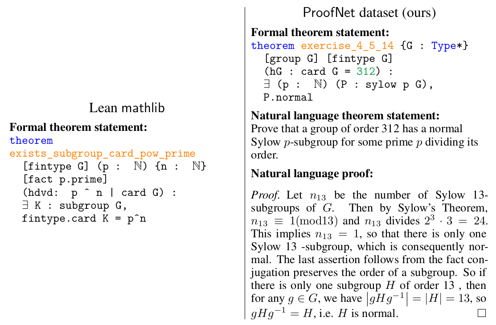

# ProofNet
> [!WARNING]
> This repository hosts the original Lean 3 version of ProofNet. Since Lean 3 is no longer maintained, you should use one of the Lean 4 ports of ProofNet, such as the one contained in [deepseek-ai/DeepSeek-Prover-V1.5](https://github.com/deepseek-ai/DeepSeek-Prover-V1.5).



Code for replicating the paper [ProofNet: Autoformalizing and Formally Proving Undergraduate Mathematics](https://arxiv.org/abs/2302.12433). 

This repo is intended for replicating experimental results and accepting PRs to the dataset. To use ProofNet for your own experiments, use the [Huggingface dataset](https://huggingface.co/datasets/hoskinson-center/proofnet). 

ProofNet is a benchmark for autoformalization and formal proving of undergraduate-level mathematics. The ProofNet benchmarks consists of 371 examples, each consisting of a formal theorem statement in Lean 3, a natural language theorem statement, and a natural language proof. The problems are primarily drawn from popular undergraduate pure mathematics textbooks and cover topics such as real and complex analysis, linear algebra, abstract algebra, and topology. We intend for ProofNet to be a challenging benchmark that will drive progress in autoformalization and automatic theorem proving.

**Citation**
```bibtex
@misc{azerbayev2023proofnet,
      title={ProofNet: Autoformalizing and Formally Proving Undergraduate-Level Mathematics}, 
      author={Zhangir Azerbayev and Bartosz Piotrowski and Hailey Schoelkopf and Edward W. Ayers and Dragomir Radev and Jeremy Avigad},
      year={2023},
      eprint={2302.12433},
      archivePrefix={arXiv},
      primaryClass={cs.CL}
}
```

# Directory Structure 
- `benchmark/` contains `.lean` and TeX source files for maintaining the dataset. If you wish to open a PR for the dataset, modify the Lean and TeX source in `benchmark/benchmark_to_publish` and run `parse_files.py`. 
- `calc_perplexity` contains scripts for calculating `proof-pile` and `arXiv` perplexity. 
- `eval` contains scripts for running the autoformalization and informalization experiments found in the paper. 
- `train_backtranslation` contains code for extracting mathlib declarations, informalizing mathlib using the OpenAI API, and fine-tuning distilled backtranslation models. 


