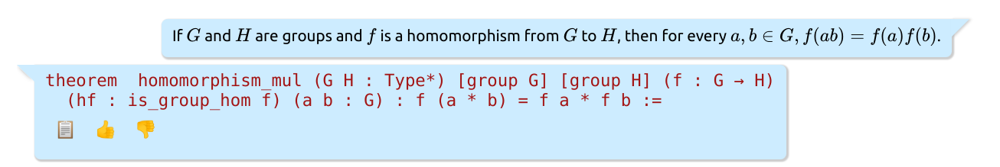
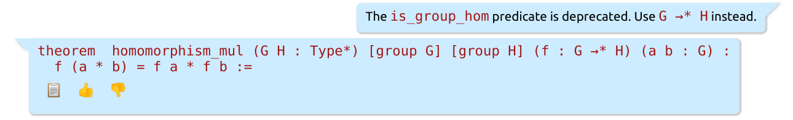
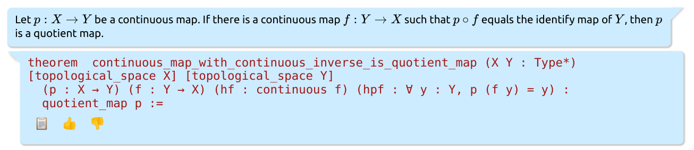
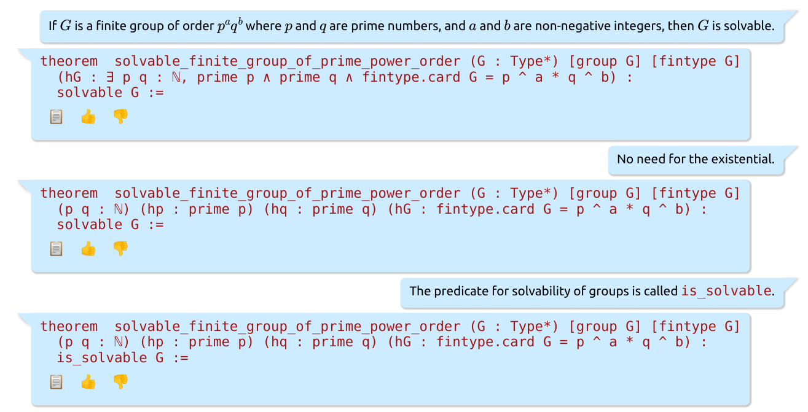
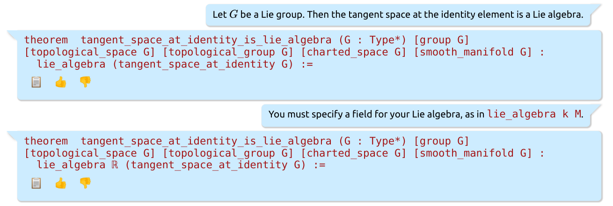
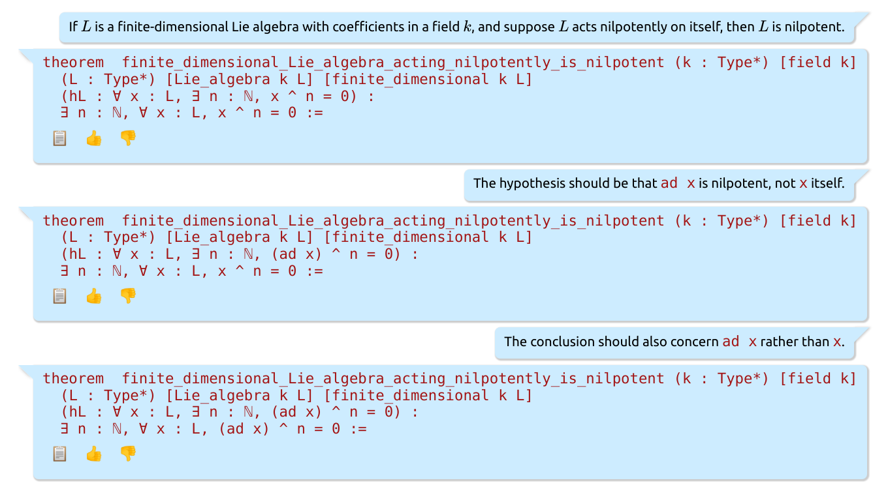
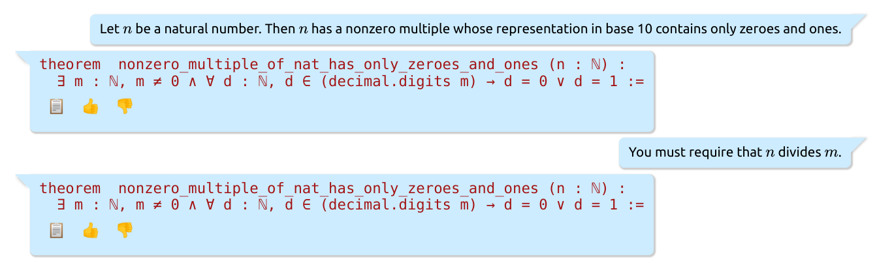

# The Future of Interactive Theorem Proving?

## Introduction

The history of interactive theorem proving can be told as a story of allowing the user to interact with the system at gradually higher levels of abstraction, getting further away from the axioms and closer to informal mathematics. Automath, the first interactive prover, floated very close to the axioms indeed. Mizar was the first attempt to make formal proofs comprehensible to mainstream mathematicians. Contemporary systems such as Coq and Isabelle add many useful features such as type classes and tactics, and most users don't have to think about what the axioms even are.  Today, there is still a learning curve to Lean, but once one learns the syntax, mathlib proofs are not terribly far from an informal version—at least compared to Automath. If we extrapolate this trend to its logical conclusion, we might imagine an interactive theorem prover where every single line of code is hidden behind the interface, and the user interacts with the machine purely in natural language. Recent advances in machine learning suggest such a system is not as far in the future as it may sound.

As a very small step towards realizing this vision, myself and Edward Ayers have developed [Lean Chat](https://marketplace.visualstudio.com/items?itemName=hoskinson-ml.lean-chat-vscode), a VS-code extension that provides an interface for autoformalizing natural language theorem statements in Lean. Under the hood, these translation are generated by OpenAI's Codex, a text generation model trained on Github source code.

The interface is straightforward: enter a theorem statement in good-old $\LaTeX$, and the app will have a go at formalizing it. If the generated formal statement is correct, fantastic! You can copy and past the statement into your Lean source file. If it is incorrect, you can give the app feedback on what to fix in a natural, conversational way. Let's see a few examples.

## Examples.
Let's begin with a simple statement about groups.



Lean would be happy with this, and we could accept it if we're feeling lenient. But the predicate `is_group_hom` is deprecated, so let's tell the app to use the up-to-date syntax.

I'm happy with that.

Let's give the app a slightly harder example, this time the statement of an exercise from James Munkres' famous topology textbook.

Perfect on the first try!

The next example is due to Johan Commelin: let's ask for a statement of Burnside's theorem, an important result in finite group theory which is not in mathlib.

Quite a lot is going on here. The app is able to figure out that the correct way of stating a group is finite is `[group G] [fintype G]`, and the correct way of denoting the order of a group is `fintype.card G`. Moreover, it is able to interpret quite high-level instructions such as "no need for the existential", suggesting the app has at least partial grasp of the semantic connection between formal and informal mathematics. Slipping up on minor syntactic conventions, like writing `solvable` instead of `is_solvable`, is one of Lean Chat's most common mistakes. These errors can almost always be fixed with dialogue.

Unfortunately, Lean Chat is far from perfect, and often fails in unpredictable and somewhat comical ways. This next example was also discovered by Johan Commelin:

For some completely unclear reason, the app decides to consider a Lie algebra over $\mathbb{R}$ instead of my explicit instruction to use a field $k$, and that's even before addressing the fact that `tangent_space_at_identity` is not a mathlib definition. I tried a few different responses to the app's initial attempt, and couldn't get it to do anything helpful.

However, the app knows at least something about Lie algebras. The next example is due to Oliver Nash.


One particular class of problem Lean Chat struggles with is Olympiad-style questions. The next example was discovered by David Renshaw:

This example is particularly embarrassing, because despite my specific instructions, the app steadfastly sticks by its initial guess.

## How does this work?
Under the hood, Lean Chat's formalizations are generated by OpenAI's [Codex](https://openai.com/blog/openai-codex/) language model. The Codex model is architecturally the same as the famous [GPT-3](https://arxiv.org/abs/2005.14165), and has a simple objective: given a string of text, predict the next word. Iterating this next-word prediction allows the model to generate coherent text. Both Codex and GPT-3 are neural networks, which means they are a function parametrized by billions of real numbers, and these parameters are tuned by gradient descent to maximize next-word prediction performance on a corpus of training data. GPT-3's training data is virtually all the text on the internet, and Codex is trained on all the source code on Github. This explains why Codex has some modest ability at writing Lean, although Lean code is a very tiny fraction of its training data.

If you take seriously the idea that neural networks are a lot like the brain, as I do, it is unsurprising that there exists some configuration of parameters that allows the network to competently use language. However, it is almost entirely a mystery why gradient descent is able to find this configuration of weights.

These language models are pattern matchers: if you ask them to complete the sentence "Not a creature was stirring, not even a \_", it will finish with the only pattern it's seen in it's training data: "mouse". We can exploit this pattern matching ability to steer our language model into doing a desired task using a technique called *few-shot prompting*. Suppose we tell GPT-3 to complete the following text
> **English**: How are you this morning?  
> **French**: Comment vas tu ce matin?  
> 
> **English**: I arrived in London late because I missed my connecting flight.  
> **French**: Je suis arrivé à Londres avec un jour de retard car j'ai raté mon vol de correspondance.  
> 
> **English**: Grothendieck was an algebraic geometer  
> **French**:

Because the language model was trained to complete patterns, given this text it will generate "Grothendieck était un géomètre algébrique". What Lean Chat does under the hood is exactly the same idea. Given the user's input, we wrap it in the following prompt:

```
Natural language version: \"If $z_1, \\dots, z_n$ are complex, then $|z_1 + z_2 + \\dots + z_n|\\leq |z_1| + |z_2| + \\dots + |z_n|$.\" Translate the natural language version to a Lean mathlib version:

theorem abs_sum_leq_sum_abs (n : ℕ) (f : ℕ → ℂ) :
  abs (∑ i in finset.range n, f i) ≤ ∑ i in finset.range n, abs (f i) :=

... (two more examples go here)...

Natural language version: \"Let $X$ be a topological space; let $A$ be a subset of $X$. Suppose that for each $x\\in A$ there is an open set $U$ containing $x$ such that $U\\subset A$. Show that $A$ is open in $X$.\" Translate the natural language version to a Lean mathlib version:

theorem subset_of_open_subset_is_open (X : Type*) [topological_space X]
  (A : set X) (hA : ∀ x ∈ A, ∃ U : set X, is_open U ∧ x ∈ U ∧ U ⊆ A):
  is_open A :=

Natural language: [Your input goes here]. Translate the natural language version to a Lean mathlib version:
```
The Codex language model completes the pattern to generate the response you see in the app. To incorporate the user's feedback, we simply concatenate the initial few-shot prompt, the model's incorrect response, and the instruction "[user's feedback goes here]. Try again:", then feed the text back into the neural network.

Note that we don't provide the model with any examples of failed and subsequently corrected statements, since then the model might start intentionally getting its first try wrong!

## What does the future look like?
Lean chat is only the very beginning for autoformalization. Codex is an off-the-shelf model available through OpenAI's API. Its creators likely never imagined it would be used for formal mathematics, and as such it is not at all optimized for that use case. The few-shot autoformalization capabilities of Codex were only noticed [quite recently](https://arxiv.org/abs/2205.12615), and the community working at the intersection of machine learning and formal math has a lot of ideas for how to improve these systems. I expect that in the comings months my examples of Lean Chat's failures will become completely outdated.

A natural next step after progress on autoformalizing theorem statements is to work on autoformalizing proofs. This is much more daunting that autoformalizing statements, but is definitely within reach. Current language model-based automatic theorem provers take as input the tactic state, and predict the next proof step. One could imagine building a prover that takes as input both a natural language proof and the tactic state to predict the next proof step, but otherwise works in exactly the same way.

Armed with these concrete ideas of how one might approach autoformalizing theorem statements and proofs, building a natural language interface to interactive theorem provers is still an ambitious project, but it is not science fiction either.
